# 内核内存映射

## 目录

- 内存映射
- bochs 页映射调试

---

```c++
// 将最后一个页表指向页目录自己，方便修改
// 不过，这样会浪费掉最后 4M 的线性地址空间，只能用来管理页表；
page_entry_t *entry = &pde[1023];
entry_init(entry, IDX(KERNEL_PAGE_DIR));
```

将前 8M 的内存映射到，自已原先的位置，供内核使用；



映射完成之后的页面分布：



## 刷新快表

- `mov cr3, eax`
- `invlpg`

```c++
// 刷新虚拟地址 vaddr 的 快表 TLB
static void flush_tlb(u32 vaddr)
{
    asm volatile("invlpg (%0)" ::"r"(vaddr)
                 : "memory");
}
```

###总结
为什么设置页目录最后一项为页目录地址后， 0xfffff000 地址对应页目录地址. 页表通过虚拟地址0xffc00000可以找到。
    因为 一页页目录可以管理4G的内存，最后一项对应的地址 正是 0xfffff000开始
    因为 0xfffff000 是页目录的地址， 第一个页表的地址保存在 页目录的索引0的位置。 

    虚拟地址：前10位 页目录索引， 中间10位 页表索引， 后12位，物理页的偏移。
    页目录地址=页目录最后一项，对应的一页开始位置保存的页目录自身的物理地址。 0xfffff000
    通过虚拟地址寻址可以得到下面的结论：
    页表地址 = 页目录索引全位1， 表示最后一个索引，页表索引全为0， 表示这页开始位置保存的页表开始的地址。

通过刷新快表，可以把虚拟地址对应的页映射刷新。
----

## 参考文献

- 郑刚 - 《操作系统真象还原》，人民邮电出版社
- <https://wiki.osdev.org/TLB>
- <https://www.felixcloutier.com/x86/invlpg>
