# 内核虚拟内存管理

## 内存布局



## 核心代码

```c++
// 分配 count 个连续的内核页
u32 alloc_kpage(u32 count);

// 释放 count 个连续的内核页
void free_kpage(u32 vaddr, u32 count);
```


### 总结
内核虚拟内存映射好后，不会在修改。但是内存映射了不代表使用了，因此需要管理内存是否使用，使用数据结构位图来管理哪些内存已经被使用了，节约内存。